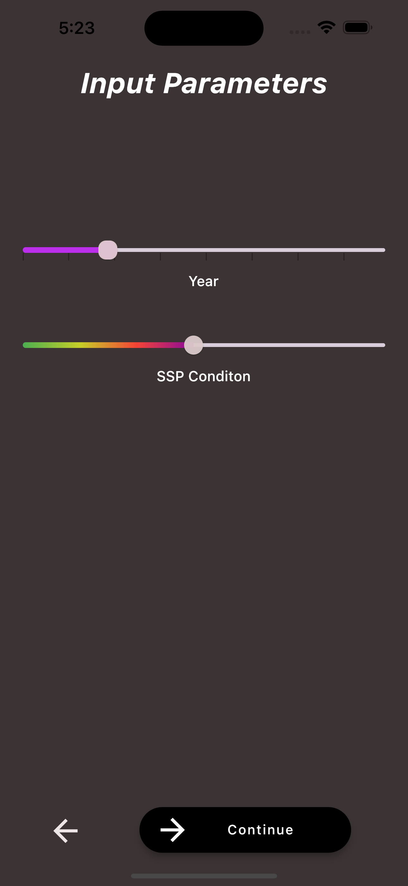
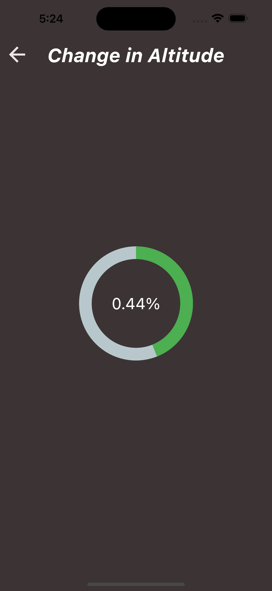

# atlantis

- This project is made for nasa space app challange 2022 for the task-"Take Flight: Making the Most of NASA’s Airborne Data
- [Project Details](https://www.canva.com/design/DAFNxthwaus/ibYStoQVWF2zweZ8q8mh5w/view?utm_content=DAFNxthwaus&utm_campaign=designshare&utm_medium=link2&utm_source=sharebutton4)

### HIGH-LEVEL PROJECT SUMMARY

Are you planning to visit Hawaii? You might not be able to go, Hawaii is particularly vulnerable to an increased rate of sea level rise in the future . If this is the case, we may have to change our way of life. Hawaii was just an example, the sea level increase is affecting many areas, but you may not know HOW MUCH and cant predict the increase in sea level in the near future. Thats why we have created an app with the help of the nasa campaign data. The ATLANTIS app is developed by our team to help people know the carbon footprint and understand the increase in sea-level easily. This App was developed using Flutter Framework. This application is a cross-platform application.

### PROJECT DEMO

https://user-images.githubusercontent.com/83648898/193469435-47f2b628-a848-4b50-8495-7f48cf91ff12.mp4

### Screenshots of UI

### DETAILED PROJECT DESCRIPTION

What does our app do ?

Our app will take these input from the user :
- Location
- Altitude
- Year
- SSP

Then based on these inputs the app shows the change in altitude (change in sea level) from past years in your area.

### What do you get by knowing the change in the sea- level?

Change in sea level is inversely proportional to the available land left to live on this earth. When the sea level increased the land for living decreases. Then slowly our place might be filled with water or even the whole earth my become like ATLANTIS. By knowing the changes in sea-level you can take measures do decrease this unnatural phenomena.

EVERY BIG CHANGE COMES WITH A SMALL STEP.
We took this step to show the unseen and uncared phenomena that going around you from ages.

### Our plans in development of this app in the future :

1. The data we have now is only about ALASKA but we are finding more data about the whole world and people can get info about every nook and corner on the earth.

2. We are planning to embed the climate, air pressure, cyclone effect, unnatural phenomena warnings, etc so that everyone can be alert and know about their surrounding.

3. We will link a GPS system by which we can track the journeys for people who travels long distance everyday (only if they give permission). By allowing this feature we can give warnings and info about the climate not only at their present location but also the locations which the cover in their journey.

ROME WAS NOT BUILT IN ONE DAY.
We need time for seeds of ideas to become fruits.

# SPACE AGENCY DATA

### How NASA's Data helped us:

- We utilized the data from ABoVE airborne campaigns ATLAS project environmental data of arctic vegetation plots as one of our sources. Besides this; data obtained and filtered from IPCC data sets are used to temperature rise in Celsius from pre-industrial revolution age as well as sea level rise from the level of 1850-the 1900s (in meters).

- We have used our brains to analyze the data and used MS EXCELL, Libre Office, etc to analyze and filter the data and saved only central values (mean values) were taken for the IPCC data. The data from ABoVE used were that off the elevation in metres of the region in ALASKA using their corresponding decimal latitude and longitude (in degrees).

- From the ABoVE data points were taken MATLAB upon applying delamay() function which the data points to a triangular mesh like form, the surface was generated using trisurl() function on the triangulated data. The vertices were defined and the surface area of the three dimension patch. The rise in area level ( in meters) between the two line frames was calculated by finding the difference between the individual quantities when done a new array was initialized initialized the tuples with non-negative elevations were sorted out.

We thank NASA for giving us the data which helped us developing our project.

### HACKATHON JOURNEY

The hackathon journey was pretty good. We worked hard without sleep for two days, analyzed, and gained knowledge about the things we never touched in our life. We found we had more potential than we think. The most important thing is we got confidence in our life that we succeed in our life with our knowledge and skill,

### REFERRED DATA FILES
- [tas_global_SSPtemps](https://github.com/bitEarth01/atlantis/blob/main/tas_global_SSPtemps.csv)
- [global_sea_level_projected](https://github.com/bitEarth01/atlantis/blob/main/global_sea_level_projected.csv)
- [altitudes and latlon](https://github.com/bitEarth01/atlantis/blob/main/altitudes%20and%20latlon.csv)

### REFERENCES
- https://2022.spaceappschallenge.org/challenges/2022-challenges/take-flight/teams/bitearth/members
- https://daac.ornl.gov/cgi-bin/dataset_lister.pl?p=34
- https://www.dkrz.de/en/communication/climate-simulations/cmip6-en/the-ssp-scenarios
- https://search.earthdata.nasa.gov/search/granules?p=C2162120307-ORNL_CLOUD&pg[0][v]=f&pg[0][gsk]=-start_date&fpj=ABoVE&tl=1664681046.532!3!!&fs10=Terrain+Elevation&fsm0=Topography&fst0=Land+Surface&lat=17.296875&long=-130.8515625
- https://lottiefiles.com/
- https://ipcc-browser.ipcc-data.org/browser/dataset?id=159
- https://www.omnicalculator.com/other/latitude-longitude-distance#:~:text=The%20distance%20between%20any%20two%20adjacent%20latitudes%20is,at%20the%20equator%20and%20meet%20at%20the%20poles
- http://www.marineregions.org/mrgid/1912
